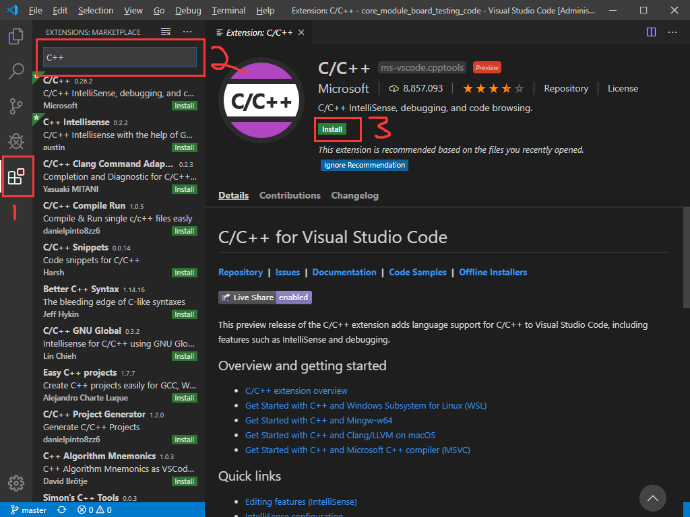

# Artinx电控工作环境配置指南

本文档旨在帮助SUSTC_Artinx机器人战队电控组正式队员能够在祖传嵌入式代码库上快速开展工作而著。

工具链如下：使用Visual Studio Code，结合队里架设的[GitLab](https://gitlab.artinx.icu/)进行代码编辑与版本控制工作;使用Keil与JLink作为下载调试工具。

[Artinx电控工作环境配置指南](#Artinx电控工作环境配置指南)
- [Artinx电控工作环境配置指南](#artinx%e7%94%b5%e6%8e%a7%e5%b7%a5%e4%bd%9c%e7%8e%af%e5%a2%83%e9%85%8d%e7%bd%ae%e6%8c%87%e5%8d%97)
  - [0x00_前置需求](#0x00%e5%89%8d%e7%bd%ae%e9%9c%80%e6%b1%82)
  - [0x01_软件安装](#0x01%e8%bd%af%e4%bb%b6%e5%ae%89%e8%a3%85)
    - [Visual Studio Code](#visual-studio-code)
    - [Git](#git)
    - [Mingw-w64](#mingw-w64)
  - [0x03_软件配置](#0x03%e8%bd%af%e4%bb%b6%e9%85%8d%e7%bd%ae)
  - [0x04 Git基础](#0x04-git%e5%9f%ba%e7%a1%80)

## 0x00_前置需求

本文档假设读者在使用Windows 10系统，并且已安装且已破解以下软件:

- Keil  uVision 5, STM32F4xx_DFP_2.13.0版本或更低
- J-Link驱动

并且假设读者已掌握下列知识点:

- 基本的嵌入式编程技术
- 基于C++的面向对象编程概念，如类、继承、虚函数等

## 0x01_软件安装

### Visual Studio Code

因为VSCode真的很好看，而且编辑起来远远比Keil方便，但是下载调试在目前看来用Keil远远比直接使用CMake + ARM_GCC + Makefile + DGB + VSCode插件方便，所以采用了编辑用VSCode，下载调试用Keil的工具链。

  1. 前往[VSCode官网](https://code.visualstudio.com/)下载并安装最新版VSCode
	

  2. 由于VSCode默认的插件安装位置在C盘，装多了会占不少空间，如果需要换一个插件安装目录，右键桌面VSCode快捷方式，打开属性->快捷方式，在原本的"目标"后加入:
		```
		--extensions-dir "VSCode插件的储存路径"
		```
		
		例如：
		```
		F:\Tools\Microsoft_VS_Code\Code.exe --extensions-dir "F:\Tools\Microsoft_VS_Code\extension"
		```

		
	
  3. 打开插件列表，搜索并安装Microsoft的C++插件:

		

### Git

考虑到电控组有同时进行多项开发的需求，每辆机器人的代码都不尽相同，分支管理非常有必要，而且VSCode自带非常友好的Git界面，所以Git也是必备的。

  1. 前往[Git官网](https://git-scm.com/)下载并安装最新版Git，在安装过程中，将默认文本编辑器改为VSCode，其他全部默认
	
   

  2. 添加环境变量:右键此电脑->属性，然后根据下图添加Git路径
   
   
   
  
  3. 打开Windows Power Shell(Win+X再按A)或是命令提示符(Win+R，输入cmd然后按回车)，输入:
		``` 
		git --version
		```
     若出现类似下图文字，即安装成功
	 
	 

### Mingw-w64

因为ARMCC的一些头文件VSCode的语法检测器不认，为了能正常使用VSCode编辑，需要安装Mingw-w64，让VSCode的语法检测器去读VSCode认识的头文件。

 1. [下载最新版本](https://sourceforge.net/projects/mingw-w64/files/Toolchains%20targetting%20Win32/Personal%20Builds/mingw-builds/installer/mingw-w64-install.exe)，安装到合适的目录，安装过程中注意32位版还是64位版。

 2. 添加环境变量
   
   
	
## 0x03_软件配置

1. 配置Git用户名与邮箱

	在命令提示符中输入:

	```
	git config --global user.name "用户名"
	git config --global user.email "用户@email.com"
	```

2. 生成ssh密钥
   
   看看是否存在C:\Users\Administrator\\.ssh文件夹，里面是否有id_rsa、id_rsa.pub文件，否则本地用使用ssh命令创建新的sshkey来创建，在命令提示符中输入:

   ```
   ssh-keygen -t rsa -C "用户@email.com"
   ```

   如果提示找不到ssh-keygen指令，自行百度"Windows 10 ssh"

   觉得麻烦的话不要设置passphrase，按两下回车跳过，再去看看C:\Users\Administrator\\.ssh文件夹，里面只要有id_rsa、id_rsa.pub就行了。

3. 去队里的[GitLab](https://gitlab.artinx.icu/)注册个账号，注册完毕登录之后点击头像->Setting->SSH Key
   
   

4. 用VSCode打开C:\Users\Administrator\\.ssh\id_rsa.pub，把里面的东西复制到GitLab的SSH Key里然后点击"Add Key"

5. 在GitLab里点击Projects->Explore projects
   
   

6. 点击All标签，找到你需要的代码仓库
   
   

7. 点击Clone按钮，并且复制HTTPS地址
   
   

8.  在VSCode里按下<kbd>CTRL</kbd>+<kbd>SHIFT</kbd>+<kbd>P</kbd>，输入git clone，粘贴刚刚复制的HTTPS地址，按下回车，应该就能把代码下载下来了

9. 下载完成后问你需不需要打开，那当然是打开，然后你就可以阅读或修改最新的代码了

10. 打开"工作目录/.vscode/c_cpp_properties.json"，在compilerPath改成你keil安装目录的compilerPath
   
   

## 0x04 Git基础

每次完成一个分支功能，都需要传到GitLab上；要传到GitLab上需要三步：stage新增、修改的代码；本地commit到合适的分支上；push到GitLab上。

 1. stage用VSCode很简单，按这个按钮就好了：
   
   

 2. 为了不影响其他人开发的分支，需要commit到自己正在开发的分支上。用VSCode新建分支方法参考下图：
   
   
   
 
 左下角显示当前在哪个分支下工作，commit的时候会commit到哪个分支。在VSCode里要commit，先要在message里描述一下当前的commit里有什么更新，再点一下commit按钮就行了，参考下图:
   
   

 3. commit完代码还在本地，要push到gitlab上，基本也是一键完成: 

   

   如果弹出登录界面，输入之前注册的GitLab账号:

   

   作为练习，请尝试clone下https://gitlab.artinx.icu/TofuLemon/core_module_board_testing_code.git，完成下列目标:
   1. 在自己电脑上的VSCode里看代码没错误
   2. Keil能通过编译并且能够给主控板烧程序
   3. 在原仓库上新建一个分支，把适配自己电脑的代码库push到这个分支上去
